# herdcat

[](https://opensource.org/licenses/MIT)
[](https://github.com/ZChenW/herdcat/releases)

A desktop cat for Wayland that herds your coding agents: it types along with you and holds up a sign for every agent session.


## Features

- 🪧 One sign per agent session, with its project, session title and state
- 🚦 Working, waiting for approval, done, stopped on error and idle at a glance
- 🖱️ Click a sign to jump to that session's terminal (niri and Sway; experimental Hyprland; pane focus in kitty, tmux and WezTerm)
- 🔔 Finished sessions stay up until you have looked at them
- ⌨️ The sign of the terminal you type in comes down under the paws
- 🎴 Two styles, fan and signpost; right-click to switch style, language, font and theme
- 🔒 No `input` group needed: a small setgid helper reads the keyboard and passes on only paw movements
- 🌗 Light and dark themes, or follow the desktop
- 🧩 An agent started by another agent joins its sign: `Claude + Codex`
- ✋ Drag the cat anywhere, the position is remembered
- 🤖 Claude Code, Codex, Grok, Kimi Code, Cursor Agent, Copilot CLI, Pi and opencode
- 🎯 Everything Bongo Cat already did: keyboard animation, hot-reload, multi-monitor, sleep mode


## Quick Start

### Install

```bash
# Arch Linux
git clone https://github.com/ZChenW/herdcat.git
cd herdcat/packaging/arch && makepkg -si

# Other distros - build from source
git clone https://github.com/ZChenW/herdcat.git
cd herdcat && make && sudo make install
```

A Nix flake is included (`nix run github:ZChenW/herdcat`, modules in [`nix/`](nix/NIXOS.md)). CI builds it on every push, but the author does not run NixOS; sign options that have no module option go through `extraConfig`.

No group membership is needed. The keyboard is read by a small helper,
`herdcat-input`, installed with the `input` group (setgid); it only tells the
cat which paw to move, never which key was pressed. See
[the security model](docs/security.md).

<details>
<summary>Not using the setgid helper</summary>

Use `sudo make install INPUT_HELPER_SETGID=0` to install an ordinary helper.
Non-root installations also use ordinary permissions and print an explanation.
If the helper is missing or not executable, herdcat uses its existing in-process
helper. Both unprivileged modes need device ACLs or the old input-group grant:

```bash
sudo usermod -a -G input "$USER"
# Log out and back in
```

Joining input lets **every process of that user read raw keyboard events**.
Prefer the setgid helper or narrowly scoped device ACLs.

</details>

### Find Your Keyboard

```bash
herdcat-find-devices  # or ./scripts/find_input_devices.sh
```

### Run

```bash
herdcat --watch-config
# Optional: force one monitor from CLI
herdcat --watch-config --monitor eDP-1
```

For automatic startup, run `systemctl --user enable --now herdcat`.
niri users can also use `spawn-at-startup "herdcat" "-w"` in their config.
Choose one startup method to avoid starting herdcat twice.

### Connect Your Agents

Connect installed agents with one command (requires Python 3):

```bash
herdcat setup                    # Preview changes, then confirm (default: no)
herdcat setup claude codex       # Select agents
herdcat setup --dry-run          # Preview without writing
herdcat setup --status           # Check all eight integrations
herdcat setup --remove claude    # Remove the integration
```

Setup preserves unrelated hooks, backs up files before writing and can update
older herdcat/bongocat hooks. Non-interactive use requires `--yes`. Restart or
reload open agents afterward; Codex also needs `/hooks` review and renewed trust.
[docs/agents.md](docs/agents.md) covers setup, backups and manual integration.

## Configuration

Create `~/.config/herdcat/herdcat.conf`:

```ini
# ═══════════════════════════════════════════════════════════════════════════
# HERDCAT CONFIG - Minimal defaults, uncomment to customize
# ═══════════════════════════════════════════════════════════════════════════

# Position & Size
cat_height=110
cat_align=center
# cat_x_offset=0
# cat_y_offset=0

# Appearance
overlay_height=120
overlay_opacity=0
overlay_position=bottom

# Input device (run herdcat-find-devices to find yours)
# keyboard_name=YOUR KEYBOARD NAME

# Session signs
# sign_style=fan          # fan, post or off
# sign_theme=light        # light, auto (XDG portal), or dark
# sign_language=auto      # auto, en or zh

# Multi-monitor (comma-separated monitor names)
# monitor=eDP-1,HDMI-A-1

# Sleep mode (optional)
# idle_sleep_timeout=300
```

Style, language and font can also be changed from the right-click card; those choices are saved outside the config file.

### Signs

Every option below goes in the same file and is applied when you save it.

| Option | Default | What it does | Example |
| --- | --- | --- | --- |
| `sign_style` | `fan` | `fan`, `post` (signpost) or `off` | 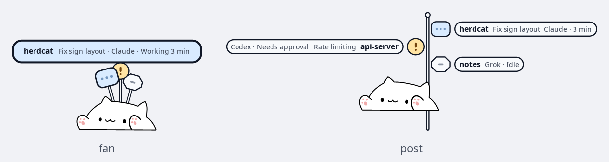 |
| `sign_max` | `10` | How many sessions get a sign, 1 to 10; the fan uses two rows above 5 | 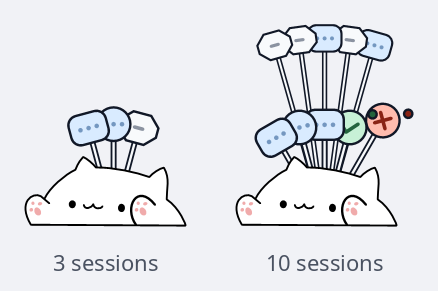 |
| `sign_idle` | `hover` | Show idle sessions on `hover`, `always` or `never` |  |
| `sign_theme` | `light` | `light`, `dark` or `auto` (follows the desktop) | 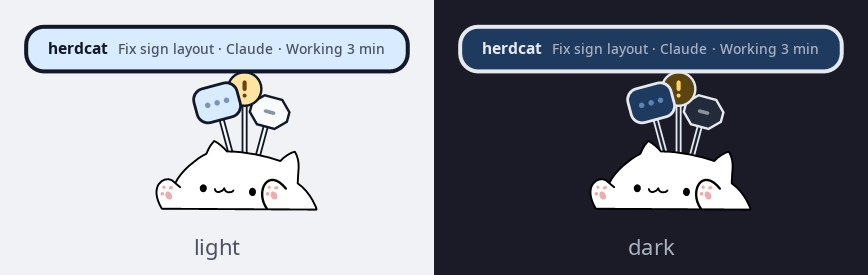 |
| `sign_language` | `auto` | `auto`, `en` or `zh` | 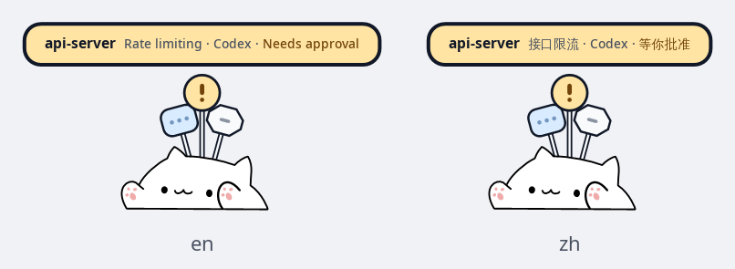 |
| `sign_font`<br>`sign_font_size` | system sans<br>`13` | Font family and size (10 to 20) | 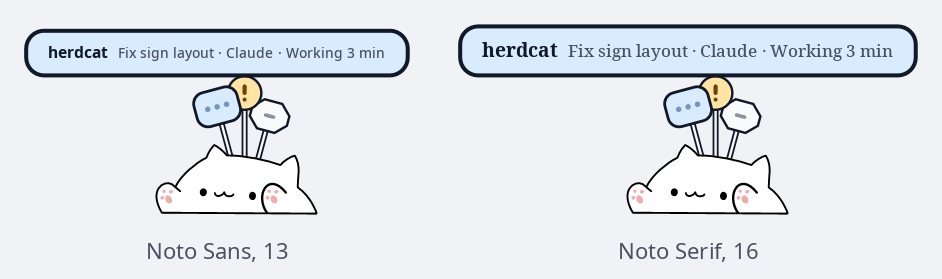 |
| `sign_animations` | `full` | `full`, `reduced` or `off` |  |
| `sign_done` | `sticky` | Finished sessions stay up until seen, or `timeout` | 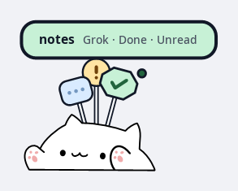 |
| `sign_typing_desk` | `1` | The sign of the terminal you type in comes down under the paws | 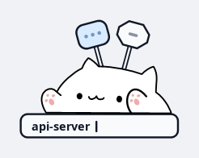 |
| `sign_desk_offset` | `0` | Move that desk away from the cat (up to 24) or closer (down to -6) | 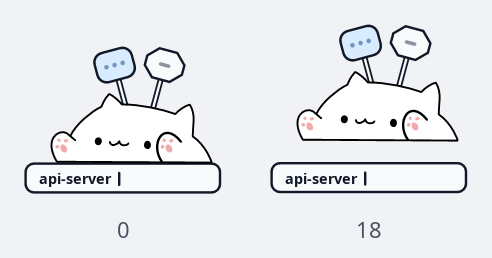 |
| `sign_name` | `project` | The bold name: `project` (directory) or `title` (session title) | 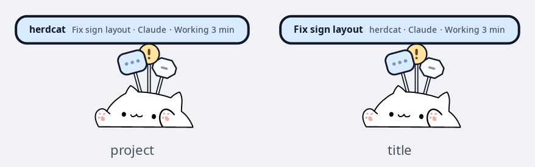 |
| `sign_name_extra` | `inline` | Where the other name goes: `inline`, `end`, `above`, `below` or `off` | 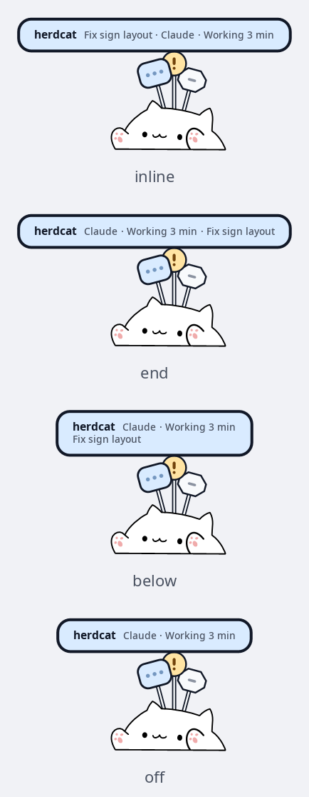 |
| `sign_title_length` | `16` | Longest title shown, 0 for all of it | 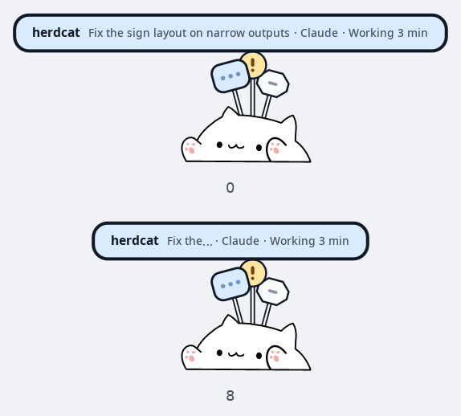 |
| `sign_nameplate` | unset | Your own nameplate, here `{agent} · **{title}**\n{project} · {state}` | 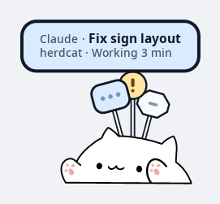 |

A nameplate template can use `{name}`, `{project}`, `{title}`, `{agent}` and `{state}`, `**bold**`, and `\n` for a second line. [herdcat.conf.example](herdcat.conf.example) has every option with a comment.

### Documentation

- [Signs, switch card, font panel and dragging](docs/signs.md)
- [Setting up each agent](docs/agents.md)
- [All options and command-line flags](docs/configuration.md), also in `man herdcat`
- [How it is built](docs/architecture.md) and [the security model](docs/security.md)

## Troubleshooting

<details>
<summary>Permission denied on input device</summary>

`herdcat --status` shows `input=denied` and `herdcat --list-devices` says which
fix applies.

Check the `input-helper=standalone` or `input-helper=in-process` indication.
For a standalone installation, check `PREFIX/lib/herdcat/herdcat-input` is owned
by `root:input` with mode `2755`. `nosuid` mounts and services with
`NoNewPrivileges=yes` suppress the setgid grant. Reinstall with root privileges;
only the helper should carry setgid, never the main binary.

For an ordinary helper or the fallback, use device ACLs or the legacy input-group
setup above. Joining the group takes effect after a new login. If `getent group
input` lists you but `id` does not, restart herdcat in a shell with the group:

```bash
systemctl --user stop herdcat
newgrp input
herdcat --watch-config
```

</details>

<details>
<summary>Cat not responding to keyboard</summary>

1. Run `herdcat-find-devices` to find the correct device
2. Set `keyboard_name` (or `keyboard_device`) in the config
3. Restart herdcat

</details>

<details>
<summary>No sign for an agent</summary>

1. Check the agent's hook is installed, see [docs/agents.md](docs/agents.md)
2. Run `herdcat --sessions` to see what the cat knows about
3. Send the agent one message; some agents only report once a turn starts

</details>

<details>
<summary>Clicking a sign does not focus the terminal</summary>

Jumping to a window supports niri and Sway (`SWAYSOCK`, no opt-in). Hyprland
still needs `compositor_experimental=1`. Sway is verified on headless 1.12;
real pointer clicks, multiple outputs and XWayland remain untested. See
[compositor support](docs/compositors.md).

Pane focus supports kitty, tmux and WezTerm. Ghostty supports window focus only.
See [docs/signs.md](docs/signs.md) for setup and limits.

</details>

## Building

```bash
git clone https://github.com/ZChenW/herdcat.git
cd herdcat
make          # Release build
make debug    # Debug build
make test     # Unit and runtime tests
```

**Requirements:** wayland-client, FreeType, Fontconfig, pkg-config, gcc/clang, make

## Credits

herdcat grew out of [wayland-bongocat](https://github.com/saatvik333/wayland-bongocat) by Saatvik Sharma, which provides the overlay, the keyboard animation and the cat itself. The Pi and opencode bridges are adapted from [OpenPets](https://github.com/OpenPetsHQ/openpets) (MIT).

## License

MIT License - see [LICENSE](LICENSE)
