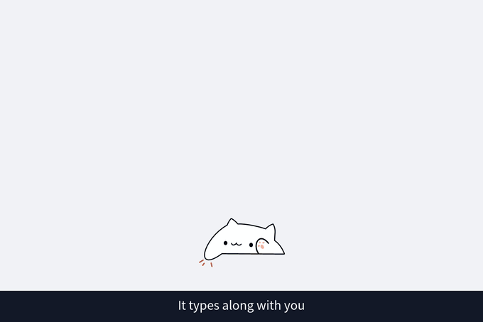
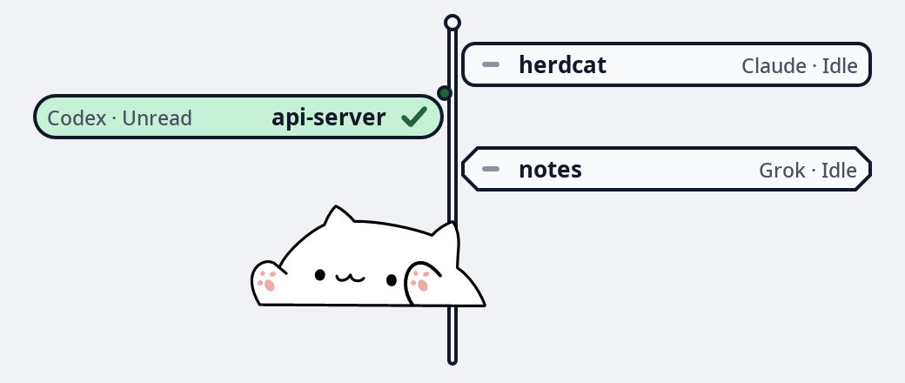

# herdcat

[](https://opensource.org/licenses/MIT)
[](https://github.com/ZChenW/herdcat/releases)

A desktop cat for Wayland that herds your coding agents: it types along with you and holds up a sign for every agent session.



## Features

- 🪧 One sign per agent session, with its name and state
- 🚦 Working, waiting for approval, done, stopped on error and idle at a glance
- 🖱️ Click a sign to jump to that session's terminal (niri, kitty splits)
- 🔔 Finished sessions stay up until you have looked at them
- ⌨️ The sign of the terminal you type in comes down under the paws
- 🎴 Two styles, fan and signpost; right-click to switch style, language and font
- ✋ Drag the cat anywhere, the position is remembered
- 🤖 Claude Code, Codex, Grok, Kimi Code, Cursor Agent, Copilot CLI, Pi and opencode
- 🎯 Everything Bongo Cat already did: keyboard animation, hot-reload, multi-monitor, sleep mode



## Quick Start

### Install

```bash
# Arch Linux
git clone https://github.com/ZChenW/herdcat.git
cd herdcat/packaging/arch && makepkg -si

# Other distros - build from source
git clone https://github.com/ZChenW/herdcat.git
cd herdcat && make && sudo make install
```

A Nix flake is included (`nix run github:ZChenW/herdcat`, modules in [`nix/`](nix/NIXOS.md)). CI builds it on every push, but the author does not run NixOS; sign options that have no module option go through `extraConfig`.

### Setup Permissions

```bash
sudo usermod -a -G input $USER
# Log out and back in
```

### Find Your Keyboard

```bash
herdcat-find-devices  # or ./scripts/find_input_devices.sh
```

### Run

```bash
herdcat --watch-config
# Optional: force one monitor from CLI
herdcat --watch-config --monitor eDP-1
```

### Connect Your Agents

Connect installed agents with one command (requires Python 3):

```bash
herdcat setup                    # Preview changes, then confirm (default: no)
herdcat setup claude codex       # Select agents
herdcat setup --dry-run          # Preview without writing
herdcat setup --status           # Check all eight integrations
herdcat setup --remove claude    # Remove the integration
```

Setup preserves unrelated hooks, backs up files before writing and can update
older herdcat/bongocat hooks. Non-interactive use requires `--yes`. Restart or
reload open agents afterward; Codex also needs `/hooks` review and renewed trust.
[docs/agents.md](docs/agents.md) covers setup, backups and manual integration.

## Configuration

Create `~/.config/herdcat/herdcat.conf`:

```ini
# ═══════════════════════════════════════════════════════════════════════════
# HERDCAT CONFIG - Minimal defaults, uncomment to customize
# ═══════════════════════════════════════════════════════════════════════════

# Position & Size
cat_height=110
cat_align=center
# cat_x_offset=0
# cat_y_offset=0

# Appearance
overlay_height=120
overlay_opacity=0
overlay_position=bottom

# Input device (run herdcat-find-devices to find yours)
# keyboard_name=YOUR KEYBOARD NAME

# Session signs
# sign_style=fan          # fan or post
# sign_language=auto      # auto, en or zh

# Multi-monitor (comma-separated monitor names)
# monitor=eDP-1,HDMI-A-1

# Sleep mode (optional)
# idle_sleep_timeout=300
```

Style, language and font can also be changed from the right-click card; those choices are saved outside the config file.

### Documentation

- [Signs, switch card, font panel and dragging](docs/signs.md)
- [Setting up each agent](docs/agents.md)
- [All options and command-line flags](docs/configuration.md), also in `man herdcat`

## Troubleshooting

<details>
<summary>Permission denied on input device</summary>

`herdcat --status` shows `input=denied` and `herdcat --list-devices` says which
fix applies.

```bash
sudo usermod -a -G input $USER
# Then log out and back in
```

Joining the group only reaches processes started after a new login. If
`getent group input` lists you but `id` does not, restart herdcat in a shell
that has the group:

```bash
systemctl --user stop herdcat
newgrp input
herdcat --watch-config
```

</details>

<details>
<summary>Cat not responding to keyboard</summary>

1. Run `herdcat-find-devices` to find the correct device
2. Set `keyboard_name` (or `keyboard_device`) in the config
3. Restart herdcat

</details>

<details>
<summary>No sign for an agent</summary>

1. Check the agent's hook is installed, see [docs/agents.md](docs/agents.md)
2. Run `herdcat --sessions` to see what the cat knows about
3. Send the agent one message; some agents only report once a turn starts

</details>

<details>
<summary>Clicking a sign does not focus the terminal</summary>

Jumping to a window needs niri. Focusing a single kitty split also needs kitty remote control, see [docs/signs.md](docs/signs.md).

</details>

## Building

```bash
git clone https://github.com/ZChenW/herdcat.git
cd herdcat
make          # Release build
make debug    # Debug build
make test     # Unit and runtime tests
```

**Requirements:** wayland-client, FreeType, Fontconfig, pkg-config, gcc/clang, make

## Credits

herdcat grew out of [wayland-bongocat](https://github.com/saatvik333/wayland-bongocat) by Saatvik Sharma, which provides the overlay, the keyboard animation and the cat itself. The Pi and opencode bridges are adapted from [OpenPets](https://github.com/OpenPetsHQ/openpets) (MIT).

## License

MIT License - see [LICENSE](LICENSE)
