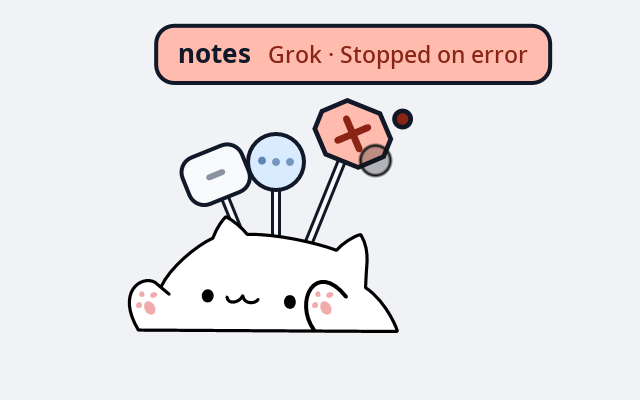

# Session signs

Each session gets a sign with a bold working-directory name and a secondary
session title by default. Missing titles are omitted. Claude uses a
rounded rectangle and Codex a circle. Click a plate to jump to its terminal on
niri, including across workspaces; dragging a plate moves the whole cat.
Missing window targets shake briefly. The cat keeps its typing and sleep frames.
Each post row pairs a state plate beside the pole with a neutral paper name
pill, separated by 6 design pixels. The state plate shares the fan's shape,
state colour, stroke and icon: Claude is 34×27 with rounded corners, Codex a
30-pixel circle, and other agents a 34×27 octagon. The 26-pixel capsule is
vertically centred on the state plate; its metadata uses secondary text colour.
Expanded rows size to their content between 150 and 340 design pixels in total
and shrink further near output edges. Collapsed rows retain only the state
plate; the pill narrows to zero and fades. Waiting and error remain expanded.
The supplement is shortened or omitted before the main name is shortened.

A kitty split is focused too when that session's process has both
`KITTY_WINDOW_ID` and `KITTY_LISTEN_ON`. Add these lines to kitty.conf
manually, or use `herdcat setup kitty --yes` to install the watcher and a
marked block with restricted remote control:

```
allow_remote_control password
remote_control_password "" focus-window
listen_on unix:${XDG_RUNTIME_DIR}/kitty-{kitty_pid}
```

`listen_on` is the socket herdcat talks to. The empty password with one
listed action lets a program on that socket move focus between kitty windows
and nothing else: it cannot type into a window, read one, or open and close
them. This is all the jump needs. The broader `allow_remote_control
socket-only` also works, but then any local program that can open the socket
can type into and read every kitty window. Restart kitty after the edit;
reloading the config does not apply `listen_on`, and only agents started
afterward carry the socket address. Without the socket, a click still focuses
the kitty window and leaves the split alone.

The typing desk follows one session and stops at the first answer. A reported
kitty split selects the session in that split. A click selects that sign until
niri focus leaves its window. Otherwise the newest session in the focused
window is used, including when no split has been reported. Moving to another
split retracts the current desk. The new split's desk appears when you type
there, not merely because focus moved. Unread completions narrow only when a
split report exists: only that split is marked seen, and a report that matches
no session marks none of them. With no report, focusing the window still marks
every session in it seen. Clicking a sign acknowledges that sign and does not
change which other split counts as seen.

A kitty watcher can report which split is focused. Copy
[`integrations/kitty/herdcat_watcher.py`](../integrations/kitty/herdcat_watcher.py) into the kitty config directory and
add one line:

```
watcher herdcat_watcher.py
```

Kitty allows more than one `watcher` line. Keep an existing watcher, such as
`focus_opacity.py`, and do not replace it. Reloading kitty.conf applies this
watcher only to windows and splits opened afterward. The script sends the
same `pane` request on herdcat's control socket. It does not start a
process and does not use `kitten @`, so it needs no extra remote-control
permission. It gives up within a few tens of milliseconds when the cat is
not running, and it writes nothing to the terminal.

## Two-row fan

`sign_max=10` is the default (range 1–10). With five or fewer visible
sessions the fan keeps its original pixels. Above five, the five highest
priorities stand in front: waiting, error, unread completion, working, then
idle. Ties retain the existing display order, which also determines left to
right order inside each row. State changes animate the angle, rod length
and row scale without recreating the session slot.

The front row is identical to the original five-sign fan. Back plates, icons,
unread dots and rod thickness are 88% size, on longer rods. Both rows fan out
symmetrically around the cat; the larger back radius uses a smaller angular
step to keep the same adjacent plate-centre spacing. Back rods, plates, icons
and unread dots always paint before every front shape, including during hover,
press, focus-failure shakes and waiting nudges. A hovered back plate enlarges
normally and its nameplate appears above both rows. Only plates are targets;
front plates own any overlap. The same ordering applies below the cat.

Post signs continue their alternating sides to ten rows at the same 30-pixel
pitch. The main name stays nearest the state plate on either side; supplement,
metadata and truncation follow the existing layout. Unread dots sit on the
state plate's upper outer corner, matching the fan. Hover, waiting nudge,
failure shake and pressed dimming affect the whole row. One hit rectangle
spans both parts and their gap, including their resting position during motion.
The same arrangement reflects below the cat. Clearance remains 180 design
pixels up to five rows and `180 + 33 * (sign_max - 5)` above five; the surface
width stays 820 at cat height 110. See the
[production-rendered split examples](design/post-split/README.md).

Menu opening
retracts both fan rows. The typing desk, switch card and font panel keep their
existing layout. Surface height follows the current allocation tier. Above/below
thresholds use that tier's capacity: zero and up to five reserve
`min(5, sign_max)` boards; the larger tier reserves `sign_max`. A 110px cat with
default-size names therefore flips below at 114px (fan) or 171px (post) in
the small tier, and at 190px (fan) or 329px (post) in the ten-board tier.
These measured budgets include two-line fan tags, hover growth, badges,
unread dots and entry overshoot plus 8 design pixels. Larger fan text adds
only its extra line-box height. Surface heights retain their previous
180 / 273 / 345 clearance budgets, separately from the flip threshold.
Returning above
requires another 24 logical pixels. Growth rechecks direction after configure
and buffer allocation, before the sixth board enters. Shrink waits the existing
ten seconds and applies the same return hysteresis. Dragging uses this same
threshold and blocks shrinking. Saved positions and edge clamping continue to
use the configured maximum. See the
[sign rows report](performance/sign-rows-report.md) and
[rendered examples](design/two-rows/README.md).

Transparent overlays use a smaller resting surface while visible signs are
closed. At cat height 110, up to five signs use 214×212 logical pixels for
the fan or 214×308 for posts; six through ten use 214×284 or 214×473.
Expanded surfaces retain the previous widths of 652/820. Waiting fan tags,
waiting/error post names, pointer entry, dragging, the switch card and font
browsing require expanded space. Unread dots keep the existing closed layout
unless hovered. Growth waits for configure and replacement buffers before
painting names; the first hover frame can take one extra configure round trip.
After names close and motion settles, shrinking waits ten seconds. New
activity cancels that deadline, keeping repeated pointer visits from causing
resize oscillation. Cat and typing-desk output coordinates stay fixed.

## Terminal support

| Terminal | Window focus | Pane focus | Current pane | Terminal configuration |
|---|---|---|---|---|
| kitty | Yes | Yes | Watcher reports | Restricted remote control and watcher (`setup kitty`) |
| tmux | Yes, through an attached client | Yes, across sessions/windows | Three global hooks | `setup tmux` |
| WezTerm | Yes, title disambiguation for shared GUI processes | Yes, across tabs/windows | On-demand CLI query | None |
| Ghostty | Yes; unique session-name title match, otherwise first candidate | Unavailable | Unavailable | None |

The closest matching process ancestor still supplies the system window. For
WezTerm, a click activates the pane first, then compares its title with niri's
windows, removing a leading `[i/n] `. Exact matches win over prefix/suffix
matches; an ambiguous or missing title falls back to the first window. Titles
are bounded to 96 bytes and used only in memory. Identical titles cannot identify
a system window reliably. Ghostty and WezTerm first use a unique window title
containing the full session title, then fall back to the previous matching rules.
Ghostty's fallback requires exactly one candidate containing the directory name. It has no external
interface for selecting a tab or split; several sessions in one window share
window-level focus and acknowledgement.

For tmux, herdcat finds the pane's session and chooses its most recently active
attached client. It focuses that client's niri window, then switches that client
to the pane. A detached session with no client shakes the sign as a missing
target. Inside kitty, it also focuses the client's kitty split before switching
tmux. Default tmux titles do not track panes, so **tmux has no title-based Escape
cancellation detection**; transcript/hook signals and existing timeout fallback
remain. A shared GUI process with several windows and no distinguishing title
still falls back to its first window (including tmux hosted by such a GUI).

```sh
herdcat setup tmux kitty --dry-run
herdcat setup tmux kitty --yes
herdcat setup tmux kitty --status
herdcat setup --remove tmux kitty --yes
```

Setup uses the existing `~/.tmux.conf` when present, otherwise
`${XDG_CONFIG_HOME:-~/.config}/tmux/tmux.conf`. It appends a marked `source-file`
block with three hooks: `window-pane-changed`, `session-window-changed` and
`client-session-changed`. Hook array entry 7313 preserves unrelated entries.
Run `tmux source-file <your tmux.conf>` or restart tmux after installation;
restart after removal to clear the already-loaded hooks. No `focus-events`
setting is required. For manual setup, source
[`integrations/tmux/herdcat.conf`](../integrations/tmux/herdcat.conf).

Kitty setup copies `herdcat_watcher.py` beside kitty.conf and appends three
managed directives: restricted remote control, an include of the focus-only
socket settings, and the watcher. Other watchers are retained. Restart kitty
after installation/removal; the socket and process environment require a new
instance. Both adapters use the same backup, dry-run, idempotency and removal
receipts as agent setup; paths and unrelated configuration survive removal.

WezTerm needs `wezterm` in herdcat's PATH and the pane's
`WEZTERM_PANE`/`WEZTERM_UNIX_SOCKET` environment. Commands use the reported
instance socket without changing herdcat's environment. `list-clients` runs
only when a WezTerm system window gains focus, or a key press needs to identify
one of several sessions in that window. Requests for one window are deduplicated
for 500 ms. There is no timer or thread polling for pane switches. A query that
fails, or CLI clients whose current panes cannot be distinguished, acknowledges
no pane. A key press waits for the asynchronous reply before assigning its typing
board. Switching panes without typing or changing system-window focus is not
observed until the next such trigger; clicking a sign always acknowledges that
sign. Mux window mappings learned from a current-pane reply keep inactive panes
in their system window even when their titles differ.

## Switch card

The card chooses its side independently of the signs. When it does not fit
above the cat but fits below, it opens below while the signs retain their
orientation. The surface grows downward before painting the first card frame;
closing keeps that space until the existing delayed shrink. If neither side
fits, the previous card direction is retained. The font panel anchors to the
actual card, including a card below above-facing signs. It retains that opening
output-space anchor while the card retracts or the main surface changes size.

Right-click the cat or a sign. The signs step down and the cat holds up a
card with four rows. Nothing on it is labelled; each row shows its choices
and an ink thumb marks the current one.

- **Style**: fan or post. The card closes and the signs come back up in the
  new style.
- **Language**: 中 or EN. Every label changes at once and the card stays.
- **Font**: the family name, drawn in that family, between two arrows. The
  arrows and the scroll wheel step through the families that cover the
  current language. The first entry is the system default.
- **Theme**: sun (light) or moon (dark). Signs, nameplates, the card and
  the font panel change together. The card stays open.

A paw taps when a row changes. The card closes after 800 ms off the cat and
card, on a second right click, or after 6 seconds idle. Clicks elsewhere on
the screen never reach an overlay, so they cannot close it. There is no card
with `sign_style=off`.

Click the font name to open the **font panel** beside the card. It lists
every family at once, two per row, each drawn in its own face, with a count
and an All / Text / Mono filter. Mono is Fontconfig spacing of 90 or more
(dual, mono, charcell); names are not inspected. The four most recently
chosen families lead the list. More than ten rows scroll with the wheel.

While the panel is open the card steps aside and every session's sign comes
up. The signs take the face under the pointer, so a face is judged on real
signs before it is chosen; moving off the cell puts the chosen face back.
Clicking a cell chooses and saves it and leaves the panel open for another
try. Move the pointer away, or right-click the cat, to finish: the panel and
the card close together. The panel is a separate surface that exists only
while it is open.

Choices live in `${XDG_STATE_HOME:-~/.local/state}/herdcat/prefs`, and the
recent families in `fonts-recent` beside it. The config file is never
rewritten. A choice applies while the config value it replaced is unchanged;
editing that option in the config file afterward makes the file win and
drops the stored choice.

**Fan** (default) raises plates behind the cat. Hover a plate for its name;
waiting plates rise higher, sway and show their names automatically.



**Post** stacks boards on an outlined pole. Hover the cat to expand
all selected names together. Idle signs appear on hover by default; signs close
150 ms after leaving. Positions follow creation order, with active and recently
updated sessions preferred when the display limit is exceeded.


These captures use the production renderer and synthetic sessions on a plain
background; they contain no desktop content.

Unread completions stay green with a dot until you visit their window, click
the sign, submit again or end the session. Visiting/clicking starts the normal
completion timer. A completion in the focused window is already seen. When a
kitty/tmux split report or WezTerm current-pane query is available, only that
split is seen. Without niri focus
tracking, completions remain unread until clicked or submitted again.

A turn that stops on an error (quota used up, API failure) turns coral with a
cross and follows the same rule: it stays, with a dot, until you have seen it.
In the fan style it is held higher than the others and named on hover.

The fan shows one nameplate at a time: the sign under the pointer, otherwise
the session that has been waiting for approval longest. Answer it and the
next one in line is named.

Typing in an agent's focused terminal moves its sign under the paws as a name
board. It leaves after 2.5 seconds without typing, focus loss, submission or
hiding. Its slot stays reserved and the board passes pointer clicks through.
This requires niri's event stream and uses activity only, never key contents.

| Global option | Values (default first) |
| --- | --- |
| `sign_style` | `fan`, `post`, `off` |
| `sign_max` | `10`; range 1–10 |
| `sign_idle` | `hover`, `always`, `never` |
| `sign_font` | empty = system sans-serif; Fontconfig family, up to 127 bytes |
| `sign_font_size` | `13`; range 10–20, metadata/desk text proportional |
| `sign_animations` | `full`, `reduced` (transitions only), `off` (instant) |
| `sign_theme` | `light` (default), `auto` (XDG portal), `dark` |
| `sign_language` | `auto`, `en`, `zh` |
| `sign_done` | `sticky`, `timeout` |
| `sign_typing_desk` | `1`, `0` |
| `sign_name` | `project`, `title` |
| `sign_name_extra` | `inline`, `off`, `end`, `above`, `below` |
| `sign_title_length` | `16`; 0–64 codepoints, 0 = unlimited |
| `sign_nameplate` | unset; fan template, ≤160 UTF-8 bytes, ≤2 lines |

The cat artwork keeps its original colours in both themes. The default is light;
automatic selection follows the XDG desktop portal through busctl without a
D-Bus library dependency.

All options reload through `-w` or `--reload`. Language `auto` uses nonempty `LC_MESSAGES`,
then `LANG`: zh locales select simplified Chinese, others English. Use `zh` to
keep the earlier fixed Chinese text. Sizes scale with cat height and output
scale. Larger text leaves less room for names. `never` hides idle signs even
on hover. `timeout` also acknowledges existing unread completions on reload;
returning to `sticky` applies to subsequent completions. `off` restores the
original surface height, cat-only input region and whole-cat agent artwork;
`sign_done` still applies. The temporary `HERDCAT_SIGN_STYLE` override is gone.

FreeType and Fontconfig are required. niri supports terminal jumping and
focus tracking. Hyprland/Sway backends require `compositor_experimental=1` and
are unverified on real compositors (see [compositor backends](compositors.md)). A kitty click reaches the
matching split only when the socket above is set. Without a split report, kitty
splits still share that window: the desk takes the newest session, and focusing
the window marks every session in it seen. Text supports Latin and CJK with
fallback, but lacks
ligatures, right-to-left shaping and combining marks. At most ten of the 32
tracked sessions are displayed. Approval still stays yellow until the tool
finishes; Claude Escape has no hook and retains the existing timeout limitation.
No sign-related periodic wakes remain when there are no sessions, hover or
keys. Reduced/off disable loops, including the desk caret blink; visible working
duration labels still update once a minute.

Truncation markers use three spaced periods from the selected font and weight,
anchored to the text baseline. A font without periods uses three circular dots.
These dots share their measurement and drawing geometry across nameplates,
post pills, the typing desk, the switch card and the font panel. Before the
first dot, the gap is at least the space between the dots, kept within 0.16–0.28 times the font size on the physical pixel grid. Dot steps
use the period's full advance. ASCII spaces before the marker are removed;
the higher ` · ` separator keeps its original spaces. The marker is omitted
as a group if its measured width does not fit.
See the [spacing comparisons](design/ellipsis-gap/README.md).

## Dragging

Hold the left mouse button on the cat and move it horizontally or vertically.
A movement of at least four logical pixels starts a drag; clicking alone keeps
the position. With cursor-shape support the cursor changes to grab/grabbing.
`--doctor` reports whether the protocol is available.

Each output saves its position on release to
`${XDG_STATE_HOME:-$HOME/.local/state}/herdcat/position`. Positions survive
restart, reload and output reconnection, and are clamped when output dimensions
change. `herdcat --reset-position` removes saved positions for every output
and restores `cat_align` / `cat_x_offset` and zero vertical margin. Configuration
files are never rewritten. `overlay_position` chooses the edge from which the
saved vertical margin is measured; `cat_y_offset` still applies inside the bar.

The cat's bounding rectangle intercepts clicks; the rest of the bar remains
click-through. Hidden cats intercept no clicks, including fullscreen hiding
when enabled. Pause still allows dragging. Set `cat_draggable=0` globally or
in a monitor section for complete click-through. Dragging between outputs is
not supported; each output has its own cat and saved position.

`sign_theme=auto` reads the XDG appearance portal using `busctl --user`, then
listens for Settings `SettingChanged` signals. Portal value 1 selects dark;
0 and 2 select light. Missing busctl or an unavailable portal starts with light;
`--doctor` reports whether busctl is available. ReadOne falls back to Read on
older portals. Listener failures reconnect with bounded backoff. Explicit light
and dark never start theme subprocesses. The card offers sun / automatic
(display icon) / moon; saved light/dark choices remain readable.

## Configurable names and fan templates

The default `project` + `inline` shows a bold directory followed by a secondary
title. Missing or equal titles are omitted, preserving the earlier appearance.
Same-directory sessions keep the same main name, without numbering.

Use `project` + `off` for directory only, `title` + `off` for title only,
`title` + `inline` for title before directory, `project` + `inline` for directory
before title, and `end` to place the extra after status. `above` / `below` use
a secondary row, omitted when the surface has insufficient clearance. The
post shows the extra after the main name in all four enabled positions; on
both sides of the pole the main name stays nearest the icon. It uses secondary
ink and metadata size, truncates with `…` into the space before agent/status,
and disappears when less than 24 logical pixels remain. `off` hides the extra
on both styles. The typing desk always shows only the main name.

```ini
sign_name=project
sign_name_extra=end
sign_title_length=8
```

Every fan tag uses a template. The built-ins are `**{name}**  {agent} · {state}`
(`off`), with the other name inserted inline, appended at the end, or placed on
a row above/below. A custom `sign_nameplate` takes priority over the extra on fan tags only; post
boards still follow `sign_name` / `sign_name_extra`:

```ini
sign_name=project
sign_nameplate={agent} · **{name}**\n{state}
```

The five placeholders are `{name}`, `{project}`, `{title}`, `{agent}`, `{state}`.
Bold markers select primary ink; other text uses secondary ink, with waiting
and error state emphasis preserved. `\n` is a literal two-character line break.
Unknown placeholders, an unclosed bold span, more than two lines or more than
160 bytes reject strict config/reload. Tolerant startup warns and falls back.
Empty ` · ` segments and empty lines disappear; a title equal to the main name
is treated as empty. Built-in inline keeps the main name when the extra is empty.
At a width limit the last secondary segments yield first; bold names yield last.

Claude's latest `ai-title` and Codex's session index provide titles at registration
and turn completion. Grok uses `summary.json`, Kimi Code uses indexed `state.json`,
and Pi uses `session_info` from the bridge's session file. Copilot reads a top-level
`name` or `summary` from its private `workspace.yaml`; opencode forwards session
metadata titles through its bridge (default `New session - ` titles are ignored).
When no title exists, Claude, Codex, Grok, Kimi, Cursor and Copilot use the first
user prompt's normalized first line as a temporary title. Blank prompts and slash
commands are ignored; a real title replaces it permanently. `--sessions` labels
these as `title~=` and real titles as `title=`. Cursor has no separate title reader.
Titles
are capped at 96 UTF-8 bytes, never logged, echoed or uploaded, and stored only
in memory and the private runtime session file; `--sessions` may show them.
All options hot-reload and are intentionally absent from the four-row switch card.

## Child agent labels

Agents launched underneath a tracked agent process share that parent's sign.
Only working or waiting children contribute to `{agent}`, in order of their
agent type's first appearance. Children have no individual sign or typing desk.

| Active children of Claude | Fan `{agent}` | Post metadata prefix |
| --- | --- | --- |
| One Codex | Claude + Codex | Claude +1 |
| Codex and Kimi | Claude + Codex + Kimi | Claude +2 |
| Two Codex | Claude + Codex ×2 | Claude +2 |
| Two Codex and one Kimi | Claude + Codex ×2 + Kimi | Claude +3 |
| Codex, Kimi and Pi | Claude + Codex + 2 | Claude +3 |

With more than two active types, only the first type is named (with `×N` if
needed); the number after it counts all sessions of the remaining types.
Custom fan templates expand the existing `{agent}` the same way. Post boards
show only the active child count, for example `Claude +2 · 3 分钟`.
No placeholder is added. A child's done/error/idle/END or process exit removes
it from the label; no active children restores `Claude`. Existing layout and
width transitions handle the text change. The name and title remain the
parent's own.

While any children are working or waiting, an idle parent or a read done parent
uses the working colour, three dots and working animation. It counts as working
for visibility (including `sign_idle=hover`), selection and front/back row
priority. Waiting, error, unread done and working parents retain their own look.
The fan nameplate, post metadata and custom `{state}` show
`等待子代理 N 分钟` / `Waiting on subagent N min` for this derived working state.
Minutes start at the earliest session creation time among still-active children;
when that child stops, the next oldest active child's start becomes the origin.
The existing minute deadline refreshes visible elapsed text. Once all children
stop, the parent's own appearance returns with the usual state transition.

Every fan sign with active children has a 13px count badge at the plate's
upper-right edge, or upper-left when an unread dot is present. The filled circle
uses ink, with a thin paper border and upright, centred bold paper digits;
counts above nine show `9+`. It follows rotation, hover, press and shake, and
scales to 88% in the back row. The circle and digit stay in the sign's shape
layer, behind every front sign when in the back row, with reflection keeping
the digit upright. Its ink contributes to damage bounds and fits the existing
surface clearance; it adds no hit target. Post boards retain their `+N` text
and have no badge. Both themes use the same semantic colours.

These rules affect sign display only. `--sessions`, `--status`, alerts, the typing
desk, focus acknowledgement and unread handling retain the real parent state.
No extra alert is generated. [Production-rendered examples](design/subagent/README.md)
cover both themes, hover, unread and the back row.


## Stable names and pointer motion

A current hook's first cwd fixes the session's start directory. The project
name follows later cwd changes only into strict subdirectories of that start.
Returning to the start, moving above it or working elsewhere keeps the last
name. Restarts preserve this rule. Untitled Claude and Codex sessions can
recover a temporary first-user-message title from a known transcript;
explicit titles still take precedence. Detached children carrying a validated
`CLAUDE_PID` remain folded into their tracked Claude parent's sign.

Settled signs reuse their frame while the selected sessions, hover/press target,
font, theme and geometry are unchanged and no animation deadline is due.
Motion still checks the live hit geometry, including plate, cat, hover-pad and
card boundaries. It does not repaint, rebuild the input region or commit a
surface merely because another packet arrived. Cursor-shape requests are
also deduplicated. Drag travel continues to use the existing surface-frame
callback gate, retaining the newest coordinates while a callback is pending.

The isolated `scripts/measure_scenarios.py --scenario pointer` scenario sends
4000 motions at a nominal 1000 Hz over four seconds, alternating by one logical
pixel inside one settled post sign. It records renderer CPU/context switches,
compositor submissions and the number of received motions; it never moves the
real desktop pointer. See [session recovery report](performance/session-recovery-report.md).
